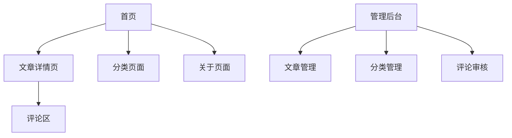

## 1. 产品概述
现代化个人博客网站，支持文章发布、分类管理和访客互动。用户可通过公网访问浏览博客内容，管理员可后台管理文章。
目标用户为个人博主和技术写作者，提供简洁优雅的内容展示平台。

## 2. 核心功能

### 2.1 用户角色
| 角色 | 注册方式 | 核心权限 |
|------|----------|----------|
| 访客 | 无需注册 | 浏览文章、查看分类、发表评论 |
| 管理员 | 后台注册 | 发布/编辑/删除文章、管理分类、审核评论 |

### 2.2 功能模块
博客网站包含以下主要页面：
1. **首页**：文章列表展示、分类导航、搜索功能
2. **文章详情页**：文章内容展示、评论区、相关文章推荐
3. **分类页面**：按分类筛选文章、分类导航
4. **关于页面**：个人介绍、联系方式、技能展示
5. **管理后台**：文章编辑、分类管理、评论审核

### 2.3 页面详情
| 页面名称 | 模块名称 | 功能描述 |
|-----------|-------------|-------------|
| 首页 | 文章列表 | 展示最新文章标题、摘要、发布时间，支持分页加载 |
| 首页 | 分类导航 | 显示所有文章分类，点击可筛选对应分类文章 |
| 首页 | 搜索功能 | 支持按关键词搜索文章标题和内容 |
| 文章详情页 | 文章内容 | 显示完整文章内容，支持Markdown格式渲染 |
| 文章详情页 | 评论区 | 访客可发表评论，显示已有评论列表 |
| 文章详情页 | 相关推荐 | 根据标签或分类推荐相关文章 |
| 分类页面 | 分类筛选 | 显示选中分类下的所有文章 |
| 关于页面 | 个人介绍 | 展示博主个人信息、头像、简介 |
| 关于页面 | 技能展示 | 以标签形式展示技术栈和技能 |
| 管理后台 | 文章管理 | 创建、编辑、删除文章，支持Markdown编辑器 |
| 管理后台 | 分类管理 | 添加、修改、删除文章分类 |
| 管理后台 | 评论审核 | 查看、批准或删除访客评论 |

## 3. 核心流程
访客使用流程：
用户访问首页 → 浏览文章列表 → 点击感兴趣的文章 → 阅读完整内容 → 发表评论 → 浏览其他文章或分类

管理员操作流程：
管理员登录 → 进入管理后台 → 发布新文章/管理现有文章 → 管理分类 → 审核评论

## 4. 用户界面设计

### 4.1 设计风格
- **主色调**：深蓝色(#1e40af)搭配白色背景，强调专业和简洁
- **辅助色**：浅灰色(#f3f4f6)用于卡片背景，绿色(#10b981)用于成功状态
- **按钮样式**：圆角矩形设计，hover效果使用阴影和颜色渐变
- **字体**：主标题使用24-32px加粗字体，正文16px，代码块使用等宽字体
- **布局风格**：卡片式布局，顶部固定导航栏，响应式网格系统
- **图标风格**：使用简洁的线性图标，统一线条粗细

### 4.2 页面设计概览
| 页面名称 | 模块名称 | UI元素 |
|-----------|-------------|-------------|
| 首页 | 导航栏 | 固定在顶部，包含logo、分类菜单、搜索框、关于链接 |
| 首页 | 文章卡片 | 白色卡片带阴影，包含标题、摘要、发布时间、阅读时长 |
| 文章详情页 | 文章头部 | 显示标题、发布时间、分类标签、阅读时长 |
| 文章详情页 | 文章内容 | 清晰的字体层次，代码块高亮，图片自适应宽度 |
| 文章详情页 | 评论区 | 简洁的评论表单，评论列表显示头像和发布时间 |
| 分类页面 | 分类标题 | 大字体显示当前分类名称和文章数量 |
| 关于页面 | 个人卡片 | 居中显示头像、姓名、简介，技能标签云展示 |

### 4.3 响应式设计
桌面优先设计，自适应平板和手机端：
- 桌面端：1200px宽度，三列网格展示文章卡片
- 平板端：768px宽度，两列网格布局
- 手机端：375px宽度，单列布局，导航栏转为汉堡菜单
支持触摸交互优化，按钮和链接具有足够的点击区域。