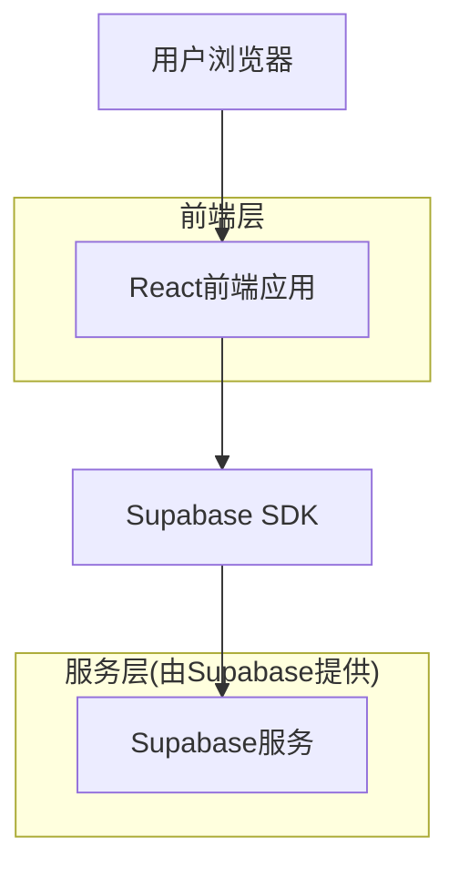
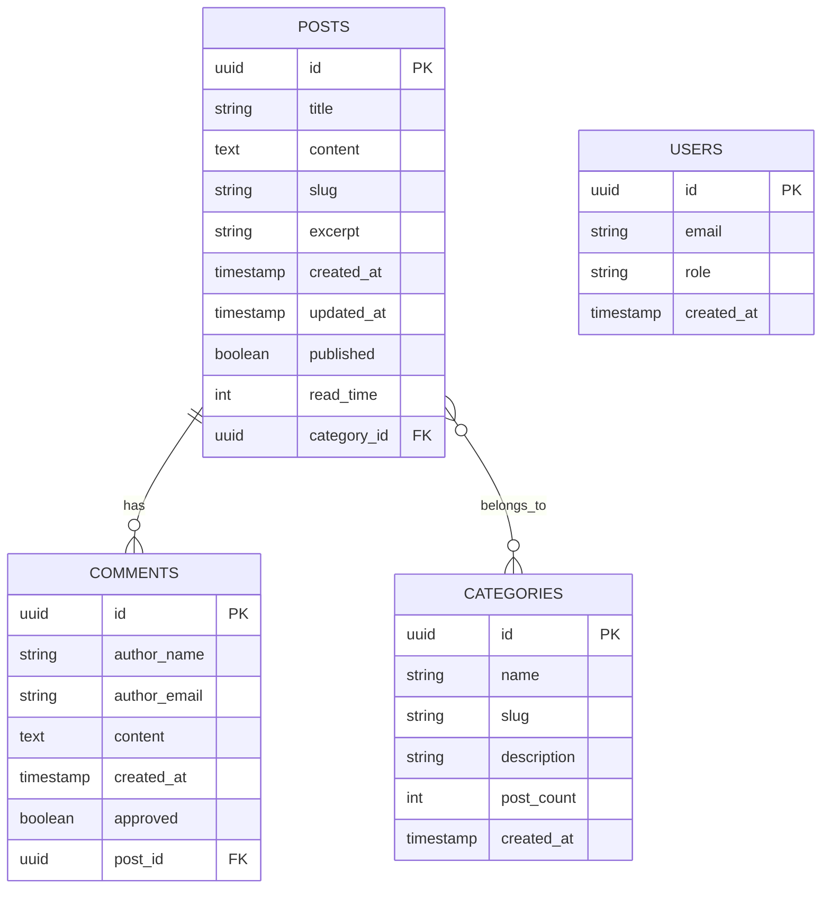

## 1. 架构设计



## 2. 技术描述

- 前端：React@18 + tailwindcss@3 + vite
- 初始化工具：vite-init
- 后端：Supabase（提供数据库、认证、文件存储）
- 部署：Vercel（支持公网访问）

## 3. 路由定义

| 路由 | 用途 |
|-------|---------|
| / | 首页，展示文章列表和分类导航 |
| /post/:id | 文章详情页，显示完整文章内容和评论 |
| /category/:name | 分类页面，显示特定分类下的文章 |
| /about | 关于页面，展示博主个人信息 |
| /admin | 管理后台登录页面 |
| /admin/dashboard | 管理后台主页面 |
| /admin/posts | 文章管理页面 |
| /admin/categories | 分类管理页面 |
| /admin/comments | 评论管理页面 |

## 4. 数据模型

### 4.1 数据模型定义



### 4.2 数据定义语言

文章表（posts）
```sql
-- 创建文章表
CREATE TABLE posts (
  id UUID PRIMARY KEY DEFAULT gen_random_uuid(),
  title VARCHAR(255) NOT NULL,
  content TEXT NOT NULL,
  slug VARCHAR(255) UNIQUE NOT NULL,
  excerpt VARCHAR(500),
  created_at TIMESTAMP WITH TIME ZONE DEFAULT NOW(),
  updated_at TIMESTAMP WITH TIME ZONE DEFAULT NOW(),
  published BOOLEAN DEFAULT true,
  read_time INTEGER DEFAULT 5,
  category_id UUID REFERENCES categories(id)
);

-- 创建索引
CREATE INDEX idx_posts_created_at ON posts(created_at DESC);
CREATE INDEX idx_posts_category ON posts(category_id);
CREATE INDEX idx_posts_published ON posts(published);
```

分类表（categories）
```sql
-- 创建分类表
CREATE TABLE categories (
  id UUID PRIMARY KEY DEFAULT gen_random_uuid(),
  name VARCHAR(100) UNIQUE NOT NULL,
  slug VARCHAR(100) UNIQUE NOT NULL,
  description VARCHAR(500),
  post_count INTEGER DEFAULT 0,
  created_at TIMESTAMP WITH TIME ZONE DEFAULT NOW()
);

-- 初始化分类数据
INSERT INTO categories (name, slug, description) VALUES
('技术分享', 'tech', '技术相关文章'),
('生活随笔', 'life', '日常生活感悟'),
('学习笔记', 'notes', '学习过程中的笔记');
```

评论表（comments）
```sql
-- 创建评论表
CREATE TABLE comments (
  id UUID PRIMARY KEY DEFAULT gen_random_uuid(),
  author_name VARCHAR(100) NOT NULL,
  author_email VARCHAR(255) NOT NULL,
  content TEXT NOT NULL,
  created_at TIMESTAMP WITH TIME ZONE DEFAULT NOW(),
  approved BOOLEAN DEFAULT false,
  post_id UUID REFERENCES posts(id) ON DELETE CASCADE
);

-- 创建索引
CREATE INDEX idx_comments_post ON comments(post_id);
CREATE INDEX idx_comments_approved ON comments(approved);
CREATE INDEX idx_comments_created_at ON comments(created_at DESC);
```

### 4.3 Supabase访问权限设置

```sql
-- 授予匿名用户读取权限
GRANT SELECT ON posts TO anon;
GRANT SELECT ON categories TO anon;
GRANT SELECT ON comments TO anon;

-- 授予认证用户完整权限
GRANT ALL PRIVILEGES ON posts TO authenticated;
GRANT ALL PRIVILEGES ON categories TO authenticated;
GRANT ALL PRIVILEGES ON comments TO authenticated;

-- 创建行级安全策略
-- 评论插入策略（无需认证）
CREATE POLICY "任何人都可以发表评论" ON comments
  FOR INSERT WITH CHECK (true);

-- 评论读取策略（只显示已批准的评论）
CREATE POLICY "只显示已批准的评论" ON comments
  FOR SELECT USING (approved = true OR auth.uid() IS NOT NULL);

-- 文章读取策略（只显示已发布的文章）
CREATE POLICY "只显示已发布的文章" ON posts
  FOR SELECT USING (published = true OR auth.uid() IS NOT NULL);
```

## 5. 部署配置

### 5.1 Vercel部署配置
创建`vercel.json`文件：
```json
{
  "builds": [
    {
      "src": "package.json",
      "use": "@vercel/static-build",
      "config": {
        "distDir": "dist"
      }
    }
  ],
  "routes": [
    {
      "src": "/(.*)",
      "dest": "/index.html"
    }
  ]
}
```

### 5.2 环境变量配置
```bash
# .env文件
VITE_SUPABASE_URL=your_supabase_url
VITE_SUPABASE_ANON_KEY=your_supabase_anon_key
```

## 6. 核心依赖包

```json
{
  "dependencies": {
    "react": "^18.2.0",
    "react-dom": "^18.2.0",
    "react-router-dom": "^6.8.0",
    "@supabase/supabase-js": "^2.8.0",
    "react-markdown": "^8.0.6",
    "remark-gfm": "^3.0.1",
    "prismjs": "^1.29.0",
    "date-fns": "^2.29.3"
  },
  "devDependencies": {
    "@vitejs/plugin-react": "^3.1.0",
    "vite": "^4.1.0",
    "tailwindcss": "^3.2.6",
    "autoprefixer": "^10.4.13",
    "postcss": "^8.4.21"
  }
}
```